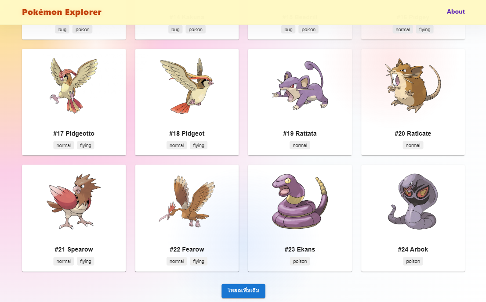
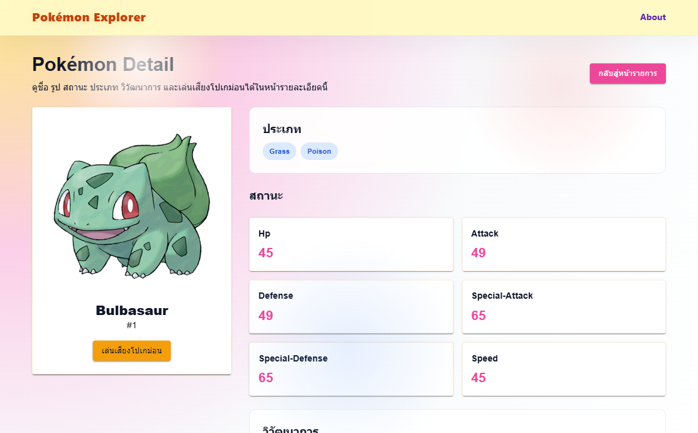
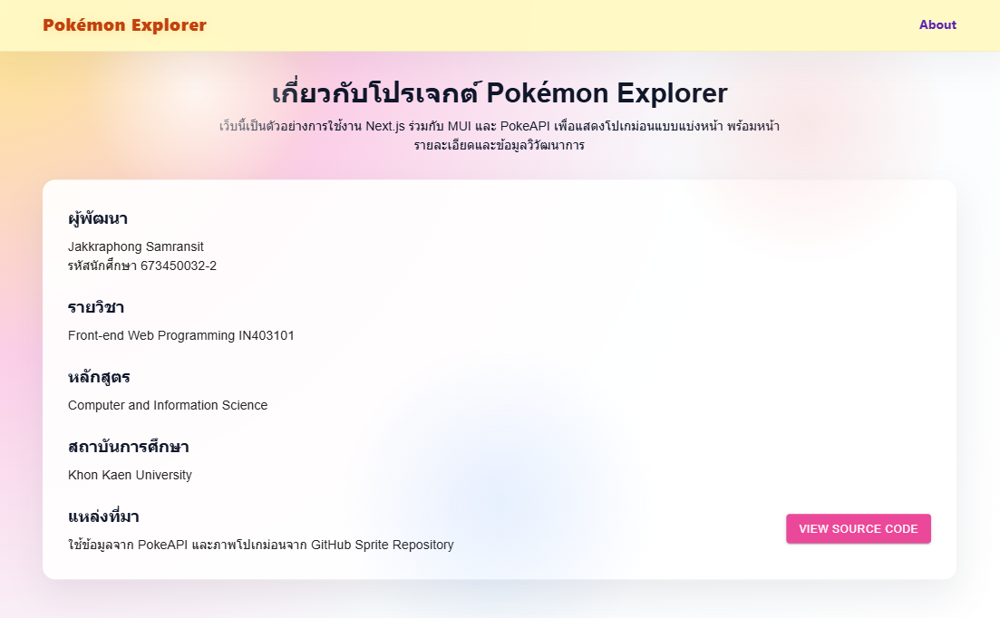

# Pokémon Explorer

Pokémon Explorer เป็นเว็บแอปที่สร้างด้วย **Next.js** และ **MUI** เพื่อแสดงข้อมูล Pokémon จาก PokeAPI แบบแบ่งหน้า (pagination)

## รายละเอียดโปรเจค

- หน้าแรกโหลดข้อมูล Pokémon ทีละหน้า ไม่ดึงข้อมูลทั้งหมด 1,351 ตัวพร้อมกัน
- ใช้เทคนิคการดึงข้อมูลทีละหน้า เพื่อให้เว็บตอบสนองเร็วและไม่หนัก
- ผู้ใช้สามารถคลิกโปเกม่อนแต่ละตัวเพื่อดูหน้ารายละเอียด
- หน้ารายละเอียดมีข้อมูลครบทั้ง:
  - ชื่อโปเกม่อน
  - ภาพโปเกม่อน
  - สถานะ (stats)
  - ประเภทของโปเกม่อน
  - ข้อมูลวิวัฒนาการ
  - ปุ่มเล่นเสียงโปเกม่อน
- ใช้ **MUI Skeleton** ในขณะที่รอโหลดข้อมูลจาก API
- มีหน้า **About this project** ที่แสดงข้อมูลผู้พัฒนา รายวิชา หลักสูตร มหาวิทยาลัย และลิงก์ GitHub
- ออกแบบ UI ให้รองรับแบบ responsive และดูสะอาดตาในโทนสี Pokémon

## คุณสมบัติสำคัญ

- Pagination สำหรับ Pokémon list
- การ์ด Pokémon แบบ responsive
- Skeleton loading state ขณะดึงข้อมูล
- หน้ารายละเอียด Pokémon ที่มีข้อมูลครบถ้วน
- Navigation ระหว่างหน้า Home และ About

## เทคโนโลยีที่ใช้

- Next.js App Router
- React
- TypeScript
- Material UI (MUI)
- PokeAPI

## ผู้พัฒนา

- ชื่อ: Jakkraphong Samransit
- รหัสนักศึกษา: 673450032-2
- รายวิชา: Front-end Web Programming IN403101
- หลักสูตร: Computer and Information Science
- สถาบันการศึกษา: Khon Kaen University

## เริ่มใช้งาน

ติดตั้ง dependencies แล้วรันโปรเจคด้วยคำสั่ง:

```bash
npm install
npm run dev
```

เปิดเว็บที่:

```
http://localhost:3000
```
### Home Page

หน้า Home Page เป็นหน้าหลักของระบบ Pokémon Explorer
ทำหน้าที่แสดงรายชื่อโปเกม่อนทั้งหมดในรูปแบบการ์ด โดยในแต่ละการ์ดจะแสดง รูปภาพ ชื่อ หมายเลข และประเภทของโปเกม่อน

ระบบใช้เทคนิค การดึงข้อมูลแบบแบ่งหน้า (Pagination) เพื่อไม่ให้โหลดข้อมูลโปเกม่อนทั้งหมด 1,351 ตัวพร้อมกัน ช่วยลดภาระของระบบและทำให้หน้าเว็บทำงานได้อย่างรวดเร็ว

ผู้ใช้สามารถกดปุ่ม “โหลดเพิ่มเติม” เพื่อดึงข้อมูลโปเกม่อนชุดถัดไป และสามารถคลิกที่โปเกม่อนแต่ละตัวเพื่อเข้าสู่หน้ารายละเอียดได้
ขณะรอการโหลดข้อมูล ระบบจะแสดง Skeleton Loading จาก Material UI เพื่อเพิ่มประสบการณ์การใช้งานที่ดีขึ้น

หน้าเว็บออกแบบให้รองรับการแสดงผลแบบ Responsive สามารถใช้งานได้ทั้งบนคอมพิวเตอร์และอุปกรณ์พกพา

### Pokemon Detail

หน้า Pokémon Detail เป็นหน้าที่ใช้แสดงข้อมูลรายละเอียดของโปเกม่อนแต่ละตัว
เมื่อผู้ใช้เลือกโปเกม่อนจากหน้า Home ระบบจะเปิดหน้าใหม่เพื่อแสดงข้อมูลเชิงลึก ได้แก่

ชื่อและหมายเลขของโปเกม่อน
รูปภาพโปเกม่อน
ประเภทของโปเกม่อน (Type)
ค่าสถานะ (Stats) เช่น HP, Attack, Defense, Speed เป็นต้น
ข้อมูลการวิวัฒนาการ
ปุ่มสำหรับ เล่นเสียงของโปเกม่อน

โครงสร้างหน้าถูกออกแบบให้แบ่งข้อมูลเป็นสัดส่วน อ่านง่าย และสวยงาม
มีปุ่มสำหรับกลับไปยังหน้ารายการโปเกม่อน เพื่อความสะดวกในการใช้งาน
### About Page

หน้า About Page เป็นหน้าที่ใช้แสดงข้อมูลเกี่ยวกับโปรเจค Pokémon Explorer
ประกอบด้วยรายละเอียดสำคัญ ได้แก่

ข้อมูลผู้พัฒนา
รายวิชา
หลักสูตร
มหาวิทยาลัย
แหล่งที่มาของข้อมูล (PokeAPI และ Sprite Repository)

ภายในหน้ายังมีปุ่มสำหรับเชื่อมไปยัง GitHub Source Code เพื่อให้สามารถตรวจสอบซอร์สโค้ดของโปรเจคได้
หน้า About ถูกออกแบบให้มีความเรียบง่าย สวยงาม และสื่อถึงวัตถุประสงค์ของโปรเจคอย่างชัดเจน
======

## GitHub Source
https://github.com/fake141213/Pokemon-app.git

## หมายเหตุเกี่ยวกับรูปภาพ

โปรเจกต์นี้ดึงข้อมูลจาก **PokeAPI** และคลังรูปภาพอย่างเป็นทางการของ Pokémon

Pokémon บางตัว โดยเฉพาะ Alternate Forms, Battle Forms หรือ Special Forms ไม่มีไฟล์รูปภาพอยู่ในฐานข้อมูลของ PokeAPI จึงไม่สามารถแสดงรูปได้ แม้ว่าจะมีข้อมูลชื่อและรายละเอียดของ Pokémon ครบถ้วน

ระบบจึงแสดงรูปภาพสำรอง (`no-image.png`) แทน เพื่อให้หน้าเว็บยังสามารถใช้งานได้ตามปกติ

ข้อจำกัดนี้เป็นข้อจำกัดของข้อมูลจาก PokeAPI ไม่ใช่ข้อผิดพลาดของตัวโปรแกรม

